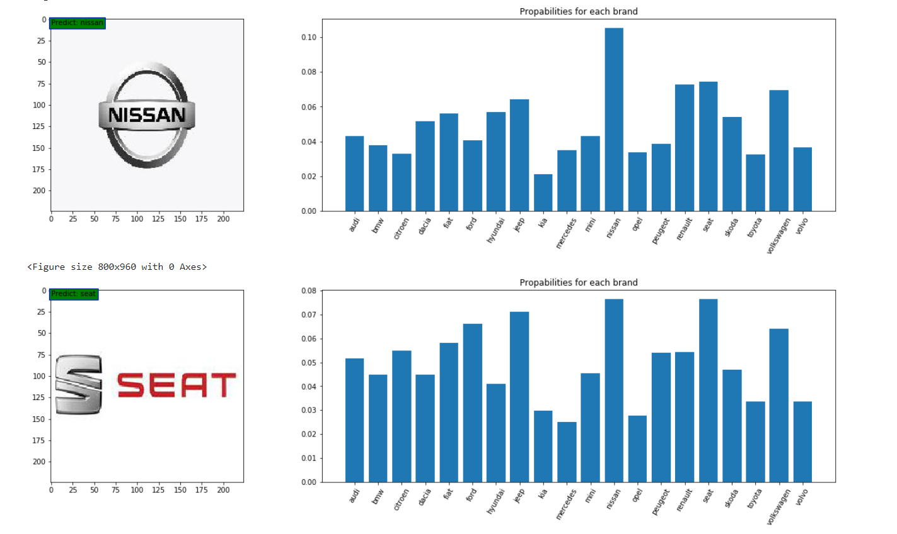
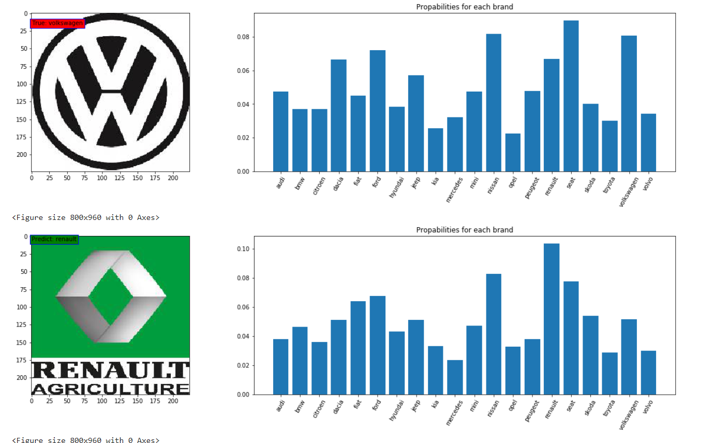
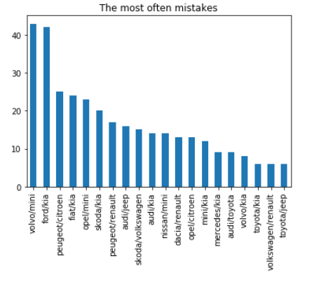

# Car Brand Logo Recognition

## Project Overview
This project aimed to create a neural network that can recognize car brands from their logos. We started by selecting the 20 most popular car brands in Europe in 2018 and gathered 1000 images for each brand from Google Graphics. After manually cleaning the data, we resized the images and organized them into training and validation sets. Using a pre-trained MobileNet model, we fine-tuned it with additional layers for our specific task. The model was trained and evaluated using Google Cloud GPU, achieving high precision and recall, demonstrating its effectiveness in accurately recognizing car brand logos.

## Objectives
- **Select 20 Popular Car Brands**: We chose the 20 most popular car brands in Europe in 2018.
- **Collect Images**: We gathered 1000 images for each brand from Google Graphics.
- **Clean Data**: We manually cleaned the images, keeping only good quality ones.
- **Build Neural Network**: We created a neural network to recognize car brands from their logos.
- **Train the Model**: We trained the model using Google Cloud GPU.
- **Evaluate the Model**: We tested the model to see how well it works.

## Conclusion
The Car Brands Detector project successfully developed a neural network to recognize car brands from their logos with high accuracy. Using a pre-trained MobileNet model and fine-tuning it with additional layers, we achieved an overall precision of 90.66%, recall of 87.00%, and an F1 score of 87.63%. The precision, recall, and F1 scores for individual brands varied, but the model consistently performed well across most brands. The confusion matrix and the most common mistakes highlighted areas where the model struggled, such as distinguishing between similar logos like Volvo and Mini or Ford and Kia. These insights provide valuable guidance for further improving the model, potentially by increasing the dataset size and diversity, or by using more advanced techniques for logo extraction and image preprocessing. Overall, the project demonstrates the feasibility and effectiveness of using deep learning for brand logo recognition.

## Acknowledgements
Special thanks to Google Graphics for providing the images and to all contributors and supporters of this project.

For more information, please visit the project's [GitHub repository](https://github.com/yourusername/car_brand_logo_recognition).

### Graphics

